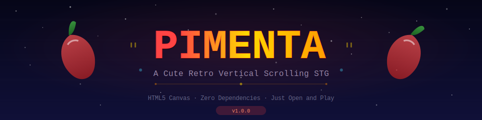

[](https://izag8216.github.io/pimenta/)

**[English](./README.md) | [日本語](./README.ja.md)**

# Pimenta

[](https://developer.mozilla.org/en-US/docs/Web/HTML)
[](https://developer.mozilla.org/en-US/docs/Web/JavaScript)
[](./LICENSE)
[](https://izag8216.github.io/pimenta/)

チリペッパーのパイロットがフードインベーダーから空を守る、キュートなレトロ風縦スクロールシューティングゲーム（STG）。

## 特徴

- **キュートなキャラクターデザイン** - チリペッパー、トマト、ナス、カボチャ、アイスクリームボス
- **3種の敵 + ボス** - ミニトマト、ナス、カボチャ、巨大アイスクリームサンデーボス
- **パワーアップシステム** - スプレッドショット、スピードブースト、シールド
- **コンボスコア** - 連続キルでスコア倍増
- **レトロビジュアル** - スキャンライン、パララックス星空、パーティクル爆発、画面シェイク
- **プロシージャルオーディオ** - Web Audio APIによるチップチューンSE
- **依存関係ゼロ** - HTMLファイル1つ、ビルドツール不要

## 操作方法

### キー操作

| キー | アクション |
|------|-----------|
| 矢印キー / WASD | 移動 |
| オートファイア | 常時発射 |
| P | ポーズ |
| M | ミュート切替 |
| Enter | スタート / リトライ |

### 遊び方

1. 上空から飛来するフードインベーダーを撃墜
2. 撃破した敵がドロップするパワーアップを取得
3. 2秒以内に連続キルでコンボを繋ぐ
4. 10ウェーブごとにボスが出現
5. ハイスコアを目指して長く生存

### 敵キャラクター

| 敵 | HP | 行動 |
|----|----|----|
| ミニトマト | 1 | 高速、直進 |
| ナス | 3 | 中速、狙い撃ち |
| カボチャ | 5 | 低速、拡散弾 |
| アイスクリームボス | 40+ | 3段階の攻撃パターン |

### パワーアップ

| パワーアップ | 色 | 効果 |
|-------------|----|----|
| スプレッドショット | 赤 | 3方向弾（5秒間） |
| スピードブースト | オレンジ | 移動速度1.6倍（5秒間） |
| シールド | 緑 | 被弾1回無効化 |

## クイックスタート

```bash
# クローン
git clone https://github.com/izag8216/pimenta.git

# プレイ
open pimenta/index.html
```

またはブラウザで直接プレイ: **[izag8216.github.io/pimenta](https://izag8216.github.io/pimenta/)**

## 技術スタック

- **HTML5 Canvas** - 2Dレンダリング
- **バニラJavaScript** - フレームワーク不使用、依存関係なし
- **Web Audio API** - プロシージャルチップチューンSE
- **localStorage** - ハイスコア保存

## ブラウザ対応

Canvas と Web Audio API をサポートするモダンブラウザ（Chrome、Firefox、Safari、Edge）で動作。

## ライセンス

[MIT](./LICENSE)

---

スパイスと共に。
